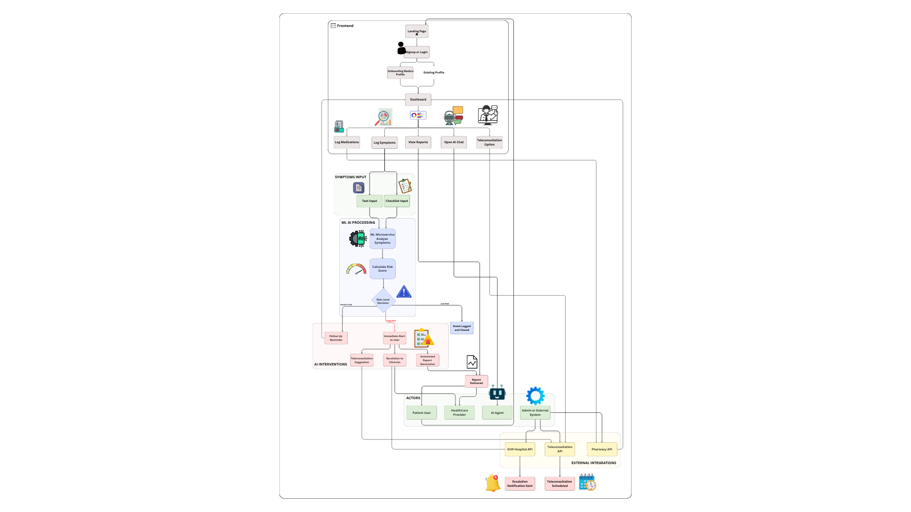

<div align="center">
  <h1>🏥 MedAware</h1>
  <p><strong>An AI-powered healthcare assistant and symptom tracking platform</strong></p>
</div>

<div align="center">


</div>

## 📖 Overview

MedAware is an intelligent healthcare platform designed to empower users with tracking, predictive analysis, and medical guidance. Combining the robust predictive power of **ClinicalBERT** and the conversational intelligence of **Mistral LLM**, MedAware helps users track symptoms, manage their daily medications, and uncover personalized risk patterns. 

Whether you're looking for an interactive conversational medical assistant or a centralized dashboard to track your health progress, MedAware seamlessly unifies advanced AI insights with a clean, user-centric interface.

---

## ✨ Features

- **🔍 Symptom Tracking & Predictive Risk Analysis**: Log your symptoms natively and instantly receive an AI-driven predictive risk assessment using ClinicalBERT.
- **🤖 AI Medical Assistant**: Chat securely with a Mistral LLM (powered by OpenRouter) that has full context of your recent symptoms and medications.
- **💊 Medication Management**: Add, track, and manage your recurring daily medications seamlessly.
- **📊 Personalized Health Insights**: Access an intuitive dashboard to visualize historical symptom trends, identify risk patterns, and view summaries of recent medical data.
- **🔐 Secure Authentication**: Integrated Firebase Authentication allowing smooth and secure sign-ups via Email/Password and Google Sign-In.

---

## 🛠 Tech Stack

### Frontend Architecture
- **Framework**: [React](https://react.dev/) + [Vite](https://vitejs.dev/)
- **Language**: TypeScript
- **Styling**: [Tailwind CSS](https://tailwindcss.com/) + [shadcn/ui](https://ui.shadcn.com/)

### Backend Architecture
- **Language**: Python
- **Framework**: [Flask](https://flask.palletsprojects.com/)
- **Database**: [MongoDB Atlas](https://www.mongodb.com/cloud/atlas)
- **Auth**: [Firebase Authentication](https://firebase.google.com/docs/auth)

### AI / Machine Learning
- **Predictive Engine**: ClinicalBERT via [Hugging Face Transformers](https://huggingface.co/docs/transformers/index)
- **Conversational AI**: Mistral LLM via [OpenRouter API](https://openrouter.ai/)

---

## 🏗️ System Architecture & Workflow

<div align="center">
  
</div>

### The MedAware Workflow

1. **User Input**: The user logs symptoms, tracks medications, or chats with the AI assistant via the React-based frontend.
2. **Authentication Interface**: Requests are authorized locally against Firebase. Token verification ensures that user data stays strictly private.
3. **API Routing**: Data passes to our high-performance Flask application handling local data operations and external AI interactions.
4. **Data Operations**: Medication and symptom streams are serialized and pushed to a NoSQL MongoDB Atlas collection.
5. **AI Inference Pipelines**:
   - Short text updates, clinical keywords, and historical symptom logs are vectorized and passed to the local/cloud **ClinicalBERT** model for risk scoring.
   - Long-form conversational questions are augmented with the user's logged conditions and routed to **Mistral LLM** securely.
6. **Insight Delivery**: Results are rapidly served back to the React UI, displaying visualizations, risk badges, and conversational responses.

---
## 🚀 Setup Instructions

Follow these instructions to run MedAware locally for development and testing.

### Prerequisites
- Node.js (v18+)
- Python (v3.8+)
- MongoDB Atlas cluster URL
- Firebase Project & Service Account Details
- OpenRouter API Key

### 1. Backend Setup

```bash
# Clone the repository
git clone https://github.com/your-username/MedAware.git
cd MedAware/backend

# Install python dependencies
pip install -r requirements.txt

# Create your .env configuration file
touch .env
```

Add your keys to the backend `.env` file:
```env
MONGO_URI="mongodb+srv://<username>:<password>@cluster.mongodb.net/?appName=Cluster0"
OPENROUTER_API_KEY="sk-or-v1-..."
```
*(Make sure that `serviceAccountKey.json` for Firebase Admin is explicitly placed inside the `backend/` directory).*

Start the Flask server:
```bash
python app.py
# Running on http://127.0.0.1:5000
```

### 2. Frontend Setup

```bash
# Open a new terminal and navigate to project root
cd MedAware

# Install npm dependencies
npm install

# Configure Firebase securely inside src/firebaseConfig.ts before launching.

# Start the Vite development server
npm run dev
# Running on http://localhost:5173
```

---

## 🌐 Live Demo

📺 **Video Walkthrough & Workflow Assets:** [Google Drive Folder Link](https://drive.google.com/drive/u/4/folders/1t2qK3svn66Jw5RXitT9riqwiiyvv8bNH)

---

## 🧭 Future Improvements

- **Wearables Integration**: Sync live data from Apple Health and Garmin for predictive heart-rate analysis.
- **Enhanced Local LLMs**: Allow completely offline inference without API limits via local quantized models.
- **Doctor/Patient Portal Integration**: Ability to export logs in HL7 FHIR formats for seamless integration with real clinical records.

---

## 🤝 Contributing

Contributions, issues, and feature requests are always welcome! 

1. **Fork** the project on GitHub
2. **Clone** the repository locally (`git clone https://github.com/your-username/MedAware.git`)
3. **Branch** out (`git checkout -b feature/AmazingFeature`)
4. **Commit** your changes (`git commit -m 'Added some AmazingFeature'`)
5. **Push** your branch (`git push origin feature/AmazingFeature`)
6. Open a **Pull Request**

<div align="center">
  <br>
  <i>Built with ❤️ for a healthier, smarter future.</i>
</div>
